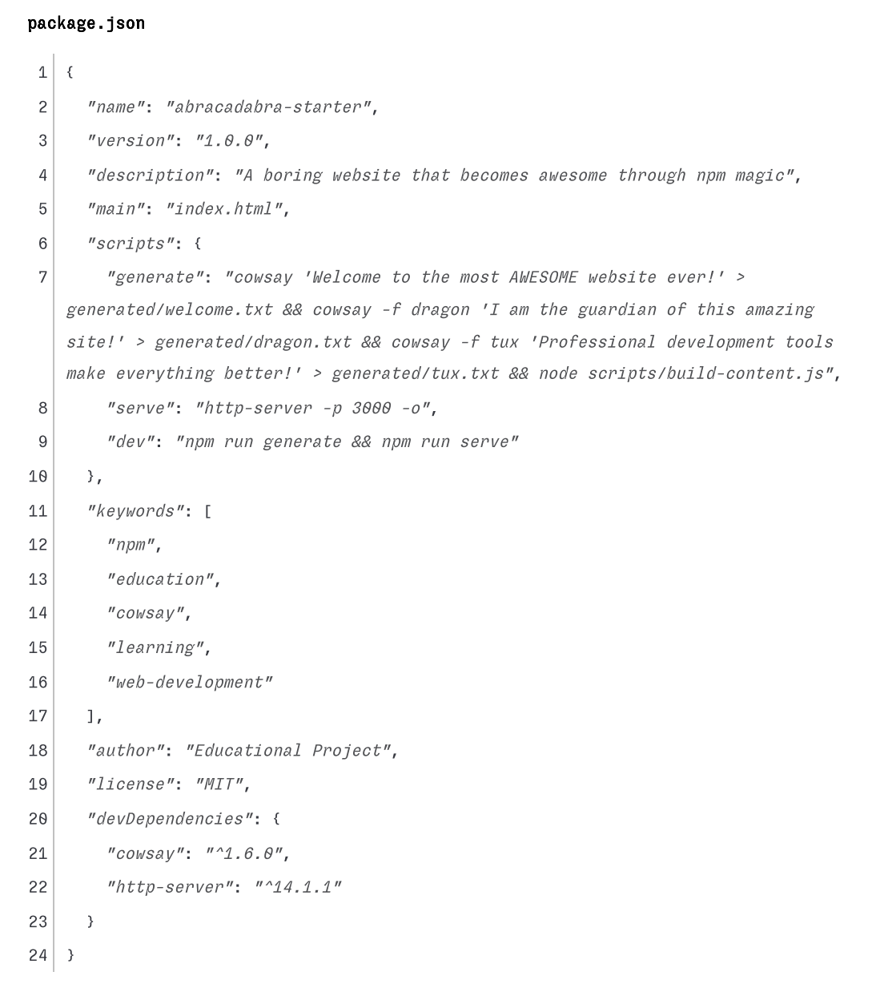

# Abracadabra! The Boring Website That Becomes Awesome

Welcome to your Abracadabra project! This project will teach you professional npm workflows and development automation by transforming a boring corporate website into something magical using cowsay and VS Code.

## Project Overview

You'll experience the power of npm scripts and development workflows by setting up automation that completely transforms a disappointing corporate website. When viewed on port 3000, the ACME Corporation content will disappear and be replaced with "Abracadabra Cow!" and colorful cowsay ASCII art, styled as a warm farm-themed website using modern typography (Fraunces + Inter fonts).

This project uses GitHub Issues as specifications - each issue represents a requirement you must complete using VS Code and its integrated terminal.

## Getting Started

### Prerequisites

- **VS Code** installed on your system
- **Node.js and npm** installed on your system
- Basic familiarity with VS Code's integrated terminal

### Step 0: Read This README with Formatting

Before starting the project, view this README with proper formatting:

1. **In VS Code Explorer**, right-click on `README.md`
2. **Select "Open Preview"** from the context menu
3. **View the formatted version** - this makes the instructions much easier to follow!
4. **Keep both tabs open** - the preview for reading, the source for editing if needed

**Pro tip**: You can also press `Ctrl+Shift+V` (or `Cmd+Shift+V` on Mac) while viewing the README.md file to open the preview.

### Step 1: Open Project in VS Code

1. **Open the project in VS Code**:
   - File → Open Folder and select this project directory
   - Or drag the project folder into VS Code

2. **Open VS Code's integrated terminal**:
   - View → Terminal (or press `Ctrl+`` on Windows/Linux,`Cmd+`` on Mac)
   - This opens the terminal panel at the bottom of VS Code

3. **Verify you're in the project directory**:
   - The terminal should show your project folder path
   - You should see files like `index.html` in VS Code's Explorer panel

### Step 2: Complete Each Specification

You'll have 2 specifications to complete using GitHub Issues:

1. **Setup npm tools** - Initialize npm, install dependencies, add scripts
2. **Run the magic** - Execute the workflow and witness the transformation

### Step 3: Track Your Progress

- Each specification starts with the label `status:todo`
- When you complete ALL requirements in a specification, change the label to `status:ready-for-review`
- Check every box in every issue - this is pass/fail with no partial credit

## Project Structure

Your project follows this structure:

```text
abracadabra-starter/
├── index.html              # Clean HTML with semantic structure
├── css/
│   └── styles.css          # Two-mode theme: muted ACME + farm-themed awesome mode
├── js/
│   └── magic.js            # Port detection and transformation logic
├── scripts/
│   └── build-content.js    # Content generation script
├── generated/              # Generated cowsay files (created by npm)
│   └── .gitkeep            # Keeps folder in git
├── .github/
│   └── ISSUE_TEMPLATE/     # GitHub issue specifications
├── package.json            # NPM configuration (you create this!)
├── .gitignore              # Git ignore file
├── README.md               # This file
│
└── docs/                   # Documentation folder
    ├── images/             # Reference screenshots and examples
    │   └── example-package-json.png  # Shows what your package.json should look like
    └── evidence/           # Screenshots for proof
        ├── spec-1/         # NPM setup evidence
        └── spec-2/         # Magic workflow evidence
```

## The Magic Transformation

### Before (Boring Mode)

- Muted ACME Corporation website with clean, professional styling
- Neutral grays and minimal design
- Loading messages for "Important Updates"
- Professional but uninspiring content
- Uses Inter font family for clean corporate look

### After (Abracadabra Mode - Port 3000 Only!)

- Clean ACME header transforms to warm farm colors
- All ACME content completely disappears
- "Abracadabra Cow!" section with colorful cowsay ASCII art
- Farm-themed styling with earthy colors (no gradients)
- Modern typography using Fraunces (headings) and Inter (body text)
- Accessible design with proper contrast ratios

## Using VS Code Effectively

### VS Code Features You'll Use

- **Explorer panel**: Watch files appear (node_modules, generated files)
- **Integrated terminal**: Run all npm commands
- **JSON editor**: Edit package.json with IntelliSense
- **File watching**: See files update in real-time

### Essential VS Code + npm Workflow

1. **Open terminal**: View → Terminal
2. **Initialize npm**: `npm init -y` (watch package.json appear in Explorer)
3. **Install packages**: `npm install --save-dev cowsay http-server`
4. **Edit scripts**: Click package.json in Explorer, add scripts with IntelliSense (see `docs/images/example-package-json.png` for reference)
5. **Run workflow**: `npm run dev` and watch the magic happen!

## Different Viewing Experiences

Test these scenarios to understand the smart port detection:

- **File:// protocol**: Right-click index.html → "Open with Default Browser"
  - Shows: "😴 Something's missing..." with development server explanation

- **Live Server (5500/5501)**: Use VS Code's Live Server extension
  - Shows: "🤔 Close, but not quite right..." with port 3000 guidance

- **Other ports**: Other development servers
  - Shows: Port-specific guidance to use "npm run serve"

- **Port 3000 without content**: Run only `npm run serve`
  - Shows: "⚡ Almost there!" with instructions to run "npm run generate"

- **Port 3000 with content**: Run `npm run dev`
  - Shows: **Complete Abracadabra transformation!**

## Evidence Requirements

Document your work with screenshots in the `docs/evidence/` folders:

### spec-1/ (NPM Setup)

- `terminal-npm-init.png` - npm init command and output
- `terminal-install-deps.png` - Installing cowsay and http-server
- `package-json.png` - Complete package.json with all scripts
- `terminal-verify.png` - npm list showing installed packages

### spec-2/ (Magic Workflow)

- `terminal-generate.png` - npm run generate output
- `terminal-serve.png` - npm run serve starting server
- `generated-files.png` - Generated files in Explorer
- `before-transformation.png` - Boring ACME page
- `after-transformation.png` - Abracadabra transformed page
- `terminal-dev-workflow.png` - Complete npm run dev execution

## What You'll Learn

This project teaches essential npm and VS Code concepts:

- **VS Code integrated terminal**: Professional development environment
- **VS Code file management**: Visual project organization
- **Package.json creation**: Project configuration and dependency management
- **npm scripts**: Task automation and workflow orchestration
- **Command chaining**: Connecting multiple operations with `&&`
- **Development servers**: HTTP vs file:// protocols
- **Build processes**: Automated content generation
- **Port detection**: Environment-aware JavaScript
- **CSS architecture**: Two-mode theming with CSS custom properties
- **Modern typography**: Web fonts and responsive design with clamp()
- **Accessibility**: Proper contrast ratios and semantic HTML

## npm Scripts Reference

Add these exact scripts to your package.json:

```json
{
  "scripts": {
    "generate": "cowsay 'Welcome to the most AWESOME website ever!' > generated/welcome.txt && cowsay -f dragon 'I am the guardian of this amazing site!' > generated/dragon.txt && cowsay -f tux 'Development tools make coding awesome!' > generated/tux.txt && node scripts/build-content.js",
    "serve": "http-server -p 3000 -o",
    "dev": "npm run generate && npm run serve"
  }
}
```

### 📸 Example package.json

Need help? Check out this example of what your complete package.json should look like:



Compare your file with this example to make sure you have:

- All required dependencies in `devDependencies`
- All three scripts (`generate`, `serve`, `dev`) with correct commands
- Proper JSON syntax (commas, quotes, brackets)

## Troubleshooting

### Editing package.json for Beginners

**Never edited a package.json before?** Don't worry! Here's a step-by-step guide:

#### Step 1: Understanding package.json Structure

Your package.json is a JSON file with this basic structure:

```json
{
  "name": "your-project-name",
  "version": "1.0.0",
  "description": "",
  "main": "index.js",
  "scripts": {
    "test": "echo \"Error: no test specified\" && exit 1"
  },
  "keywords": [],
  "author": "",
  "license": "ISC",
  "devDependencies": {
    "cowsay": "^1.6.0",
    "http-server": "^14.1.1"
  }
}
```

#### Step 2: Adding Scripts Safely

1. **Find the "scripts" section** - it looks like `"scripts": {`
2. **Remove the test script** - delete the line: `"test": "echo \"Error: no test specified\" && exit 1"`
3. **Add your three scripts** - copy from the example above
4. **Check your commas** - every line except the last needs a comma at the end

#### Step 3: Common JSON Mistakes to Avoid

❌ **Missing commas between items:**

```json
"scripts": {
  "generate": "cowsay ..."
  "serve": "http-server..."  // Missing comma above!
}
```

✅ **Correct comma placement:**

```json
"scripts": {
  "generate": "cowsay ...",
  "serve": "http-server..."   // No comma on last item
}
```

❌ **Missing quotes around keys:**

```json
scripts: {  // Missing quotes around "scripts"
  generate: "cowsay ..."  // Missing quotes around "generate"
}
```

✅ **Correct quotes:**

```json
"scripts": {
  "generate": "cowsay ..."
}
```

#### Step 4: Using VS Code's JSON Help

- **Red underlines**: VS Code shows JSON errors with red squiggly lines
- **Hover for details**: Hover over red lines to see what's wrong
- **Auto-formatting**: Right-click → "Format Document" to fix indentation
- **IntelliSense**: VS Code suggests completions as you type

#### Step 5: Verify Your Work

Compare your package.json with our **example screenshot at `docs/images/example-package-json.png`** to make sure:

- ✅ Both `cowsay` and `http-server` are in `devDependencies`
- ✅ All three scripts (`generate`, `serve`, `dev`) are present
- ✅ Script commands match exactly (copy-paste to avoid typos)
- ✅ No red underlines in VS Code
- ✅ File saves without errors

### VS Code Issues

- **Terminal won't open**: View → Terminal or restart VS Code
- **Wrong directory**: Use `cd` command or restart VS Code in correct folder
- **JSON errors**: VS Code underlines syntax errors in red - fix them using the guide above!
- **Can't save package.json**: Check for JSON syntax errors first

### npm Issues

- **"cowsay not found"**: Run `npm install --save-dev cowsay` in VS Code terminal
- **"http-server not found"**: Run `npm install --save-dev http-server` in VS Code terminal
- **Page still boring**: Ensure you're on `localhost:3000`, not file:// or other ports
- **Scripts not working**: Check package.json syntax using the beginner guide above
- **Permission errors**: Don't use `sudo` with npm
- **"npm run generate" fails**: Make sure the `generated/` folder exists
- **"npm run serve" fails**: Check that http-server was installed properly

### JSON Syntax Quick Reference

- **Strings**: Always use double quotes `"like this"`
- **Objects**: Use curly braces `{ }`
- **Arrays**: Use square brackets `[ ]`
- **Commas**: Between items, but NOT after the last item
- **No trailing commas**: `{"key": "value"}` not `{"key": "value",}`

## Completion Checklist

This project is **PASS/FAIL**. To pass, you must:

- [ ] Complete ALL requirements in BOTH specification issues
- [ ] Check every box in every specification
- [ ] Provide all evidence screenshots in correct docs/evidence/ folders
- [ ] Successfully run the complete npm workflow (`npm run dev`)
- [ ] Witness the full Abracadabra transformation on port 3000

## Need Help?

- Review the GitHub Issues specifications carefully
- Use VS Code's integrated terminal for all npm commands
- Check console logs for debugging information
- Ensure all evidence screenshots are clear and complete
- Verify you're testing on the correct ports

---

Ready for some npm magic? Follow the GitHub Issues, use VS Code effectively, and watch your boring corporate website transform into something awesome! 🪄✨
